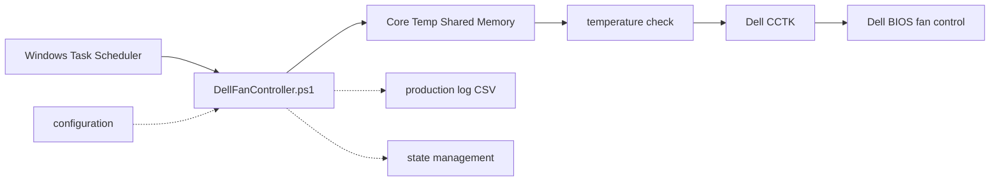

# Dell Fan Controller

Dell Fan Controller is a PowerShell controller for selected Dell systems where Dell Command | Configure exposes `FanCtrlOvrd`. It reads CPU temperature from Core Temp shared memory and can temporarily enable Dell fan override, then restore Dell automatic fan control.

This project touches hardware and BIOS-related fan-control settings. Use it at your own risk, test read-only modes first, and use only on hardware you understand and can recover manually.

## Architecture



This is the short version of the runtime path: the Scheduled Task starts the controller, Core Temp provides readings, the controller decides whether boost is needed, and Dell CCTK applies verified fan-control changes. See [Architecture](docs/ARCHITECTURE.md) for the full diagrams and safety boundaries.

## Features

- Core Temp shared-memory temperature snapshots.
- Consecutive-high temperature logic before fan boost.
- Dell CCTK backend with exact allowlisted `--FanCtrlOvrd` arguments.
- Explicit hardware-write switch and confirmation string.
- Startup recovery, state ownership, cleanup, restore and cooldown flow.
- Single-instance mutex and fail-closed validation.
- Hermetic fake-backend tests for CI-safe validation.
- Optional Windows Task Scheduler installation helper.

## Supported Environment

- Windows PowerShell 5.1.
- Windows on supported Dell hardware.
- Core Temp installed and running with shared memory available.
- Dell Command | Configure installed separately from Dell.
- Administrator rights for production mode and Scheduled Task setup.

No Dell, Core Temp, LibreHardwareMonitor, or other third-party binaries are bundled in this repository.

## Quick Start

```powershell
Set-Location 'C:\DellFanController'
Copy-Item .\controller-config.example.json .\controller-config.production.json
notepad .\controller-config.production.json
```

Then run the read-only checks:

```powershell
powershell.exe -NoProfile -ExecutionPolicy Bypass -File .\DellFanController.ps1 -ConfigPath .\controller-config.production.json -EnableProductionMode -ValidateOnly
powershell.exe -NoProfile -ExecutionPolicy Bypass -File .\DellFanController.ps1 -ConfigPath .\controller-config.production.json -EnableProductionMode -StartupOnly
```

Normal production mode requires both the switch and exact confirmation:

```powershell
powershell.exe -NoProfile -ExecutionPolicy Bypass -File .\DellFanController.ps1 -ConfigPath .\controller-config.production.json -EnableProductionMode -AllowHardwareWrites -HardwareWriteConfirmation 'ENABLE_AUTOMATIC_DELL_FAN_CONTROLLER'
```

For a short first run, add `-RunMinutes 10`.

## Configuration Example

```json
{
  "SchemaVersion": 1,
  "ThresholdCelsius": 75,
  "PollIntervalSeconds": 30,
  "RequiredConsecutiveHighReadings": 2,
  "BoostDurationSeconds": 150,
  "CooldownSeconds": 300,
  "DryRun": false,
  "SensorProvider": "CoreTempSharedMemory",
  "Backend": "DellCctk",
  "CctkPath": "C:\\Program Files (x86)\\Dell\\Command Configure\\X86_64\\cctk.exe",
  "CommandTimeoutSeconds": 15,
  "StatePath": "logs\\dell-fan-controller-state.dellcctk.json",
  "LogPath": "logs\\dell-fan-controller-production.csv"
}
```

## Safe Stop And Restore

Stop the controller by ending the PowerShell process or disabling the Scheduled Task manually. Do not delete state files until Dell automatic fan control is verified.

Emergency restore helper:

```powershell
powershell.exe -NoProfile -ExecutionPolicy Bypass -File .\scripts\Restore-DellAutomatic.ps1 -ConfirmRestore
```

This intentionally performs a hardware write and requires explicit confirmation.

## Tests

CI runs parser checks and selected fake-only tests. Hardware, Core Temp, CCTK live probing, `ValidateOnly`, `StartupOnly`, and normal controller runs are manual only.

## Documentation

- [Installation](docs/INSTALLATION.md)
- [Configuration](docs/CONFIGURATION.md)
- [Usage](docs/USAGE.md)
- [Scheduled Task](docs/SCHEDULED_TASK.md)
- [Architecture](docs/ARCHITECTURE.md)
- [Safety](docs/SAFETY.md)
- [Troubleshooting](docs/TROUBLESHOOTING.md)
- [Testing](docs/TESTING.md)
- [Known Limitations](docs/KNOWN_LIMITATIONS.md)
- [Validation Evidence](docs/VALIDATION_EVIDENCE.md)
- [Security](SECURITY.md)
- [Contributing](CONTRIBUTING.md)
- [Publish Checklist](PUBLISH_CHECKLIST.md)
- [Sanitization Report](SANITIZATION_REPORT.md)
- [File Manifest](FILE_MANIFEST.md)
- [License Options](LICENSE-OPTIONS.md)

This project is not affiliated with, endorsed by, or supported by Dell, Core Temp, or their owners.
