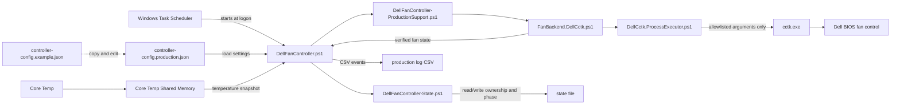
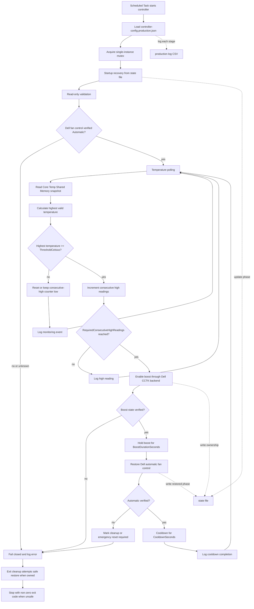
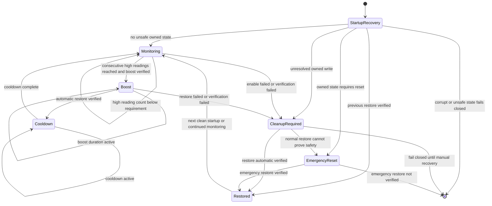

# Architecture

Dell Fan Controller is organized around one production entrypoint, a small set of support modules, a Core Temp read-only sensor path, and a Dell CCTK backend that is deliberately narrow. The design goal is to make the normal monitoring loop simple while keeping hardware writes explicit, verified and recoverable.

## High-Level Architecture

The controller is the runtime coordinator. It reads the production config, reads Core Temp shared memory, calls support code to build a Dell CCTK production session, and records every meaningful transition in the production CSV log and state file. Hardware access is isolated behind the Dell backend and process executor; the executor accepts only exact command specifications such as the `FanCtrlOvrd` query, enable and restore commands.

## Runtime Flow

The production loop first proves it can run safely: config must validate, the mutex must be acquired, startup recovery must not find unsafe unresolved ownership, Core Temp must provide usable data, and Dell CCTK must report a safe automatic starting state. Only after consecutive high readings does the controller enable fan override. Every write is followed by read-back verification. If validation, sensing, CCTK execution or verification fails, the controller logs the failure and fails closed instead of continuing blindly.

## State Machine

The runtime state file is not a general cache; it is a safety record. It tracks whether this controller instance owns a fan override operation and which phase was last verified. That lets startup recovery distinguish a clean idle/restored state from an interrupted enable, active boost, pending restore, or cleanup-required condition. When ownership cannot be proven or automatic control cannot be verified, the safe behavior is to block new boost attempts and require recovery.

## Main Components

| Component | Role |
| --- | --- |
| `DellFanController.ps1` | Production entrypoint, config loading, mutex, polling loop, boost/restore orchestration and logging. |
| `controller-config.production.json` | Local production configuration copied from the public example and ignored by Git. |
| `Discover-CoreTempSharedMemory.ps1` | Read-only Core Temp shared-memory snapshot reader. |
| `DellFanController-State.ps1` | State schema, validation, atomic writes, backup recovery, ownership and cleanup decisions. |
| `DellFanController-ProductionSupport.ps1` | Builds the production CCTK session and formats backend diagnostics. |
| `FanBackend.DellCctk.ps1` | Backend contract implementation for Dell `FanCtrlOvrd` query, enable, restore and emergency reset. |
| `DellCctk.ProcessExecutor.ps1` | Process execution boundary with exact executable and argument validation. |
| `cctk.exe` | Dell Command \| Configure executable installed separately by the user. |
| Production log CSV | Append-only operational trace for monitoring, boost, restore, cooldown and failure events. |
| State file | Runtime safety record used for startup recovery and cleanup. |

## Safety Boundaries

- `ValidateOnly` and `StartupOnly` are read-only production checks.
- Normal production mode requires administrator rights, `-AllowHardwareWrites`, and the exact `ENABLE_AUTOMATIC_DELL_FAN_CONTROLLER` confirmation.
- The backend only builds exact allowlisted CCTK command specs.
- The executor rejects non-`cctk.exe` paths, unexpected arguments, malformed results and unconfirmed write operations.
- State transitions are written atomically and verified after write.
- Unknown sensor data, unknown fan state, duplicate instances and failed verification all lead to fail-closed behavior.
